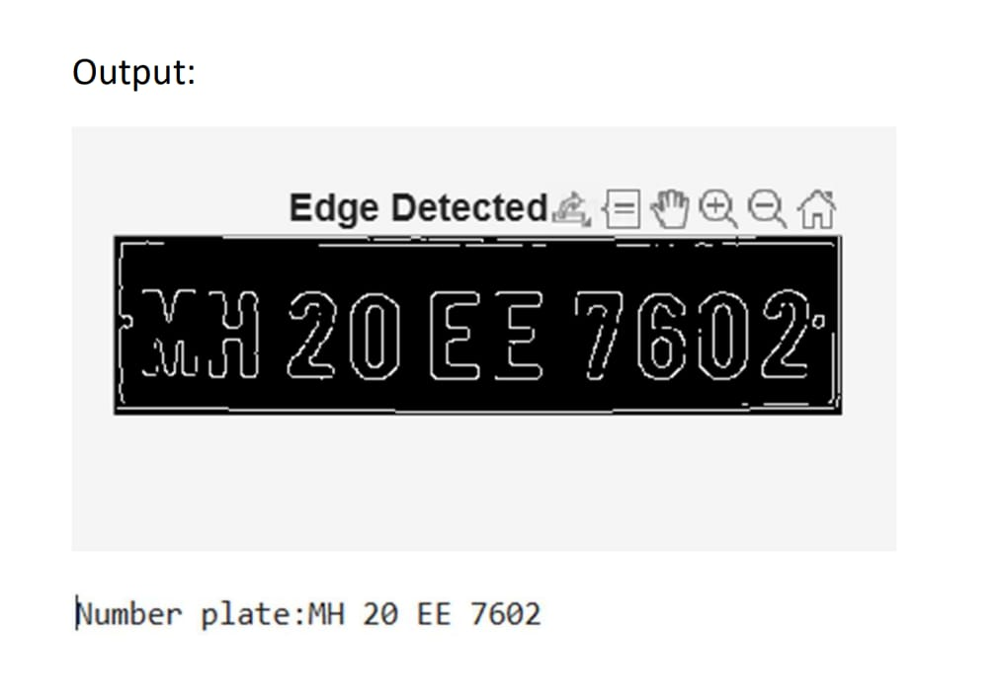

# Vehicle Number Plate Detection (MATLAB)

## Overview
This project detects vehicle number plates from images using image processing techniques and extracts the plate number using OCR.

## Files
- plate_detection.m → MATLAB code
- car.jpg → Input image
- output.jpeg → Edge-detected number plate

## Methodology
- Image sharpening
- Grayscale conversion
- Adaptive thresholding
- Noise removal
- Region filtering based on size and aspect ratio
- Edge detection (Canny)
- OCR for number extraction

## Output

### Edge Detection

### Detected Number Plate
MH 20 EE 7602

## Limitations
- Works best with front-facing vehicles
- Sensitive to lighting and angle variations
